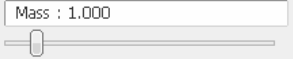

# SLIP Model Simulation in 3D Motion

This project provides a simulation of the `SLIP (Spring Loaded Inverted Pendulum)` model in 3D motion using PyBullet. The model allows you to adjust various parameters for the simulation. It includes kinematic equations that can be utilized for other simulations, and the project comes with a pre-configured URDF file that you can modify.

## Table of Contents

- [Introduction](#introduction)
- [Features](#features)
- [Requirements](#requirements)
- [Installation](#installation)
- [Usage](#usage)
  - [Adjustable Parameters](#adjustable-parameters)
  - [URDF File Modification](#urdf-file-modification)
- [Kinematic Equations](#kinematic-equations)
- [Functions](#functions)
- [Contributions](#contributions)

## Introduction

The SLIP model is a simplified model used to describe the kinematics of a running or hopping robot. In this project, we simulate the SLIP model in 3D motion, where you can adjust physical parameters such as spring stiffness, spring length and mass. This simulation provides insights into the behavior of a spring-loaded inverted pendulum in simulation environments, and can be useful for researchers and engineers working in robotics.

## Features

- 3D simulation of the SLIP model using PyBullet
- Configurable physical parameters for the simulation (spring stiffness, spring length, etc.)
- Kinematic equations available for other simulations
- Pre-configured URDF file, which can be modified

## Requirements

- Python 3.x
- PyBullet
- NumPy

## Installation

1. Clone this repository:
   ```bash
   git clone https://github.com/FRA333-Kinematics-of-Robotics-System/SLIP-Model-Simulation.git
   ```
2. Install the required Python packages:
   ```bash
   pip install pybullet numpy
   ```
3. Moving path to project directory:
   ```bash
   cd SLIP-Model-Simulation
   ```
4. Open Visual Studio Code for run a python:
   ```bash
   code .
   ```

## Usage

### Adjustable Parameters

You can modify the following parameters to customize the simulation:

#### `Spring Stiffness`:

- Stiffness of the spring (N/m)
- Adjust via Pybullet param on top right of simulation.
- Or Adjust in `Pybullet_Simulation.py` file at `line 44`.

#### `Mass`:

- Mass of the robot (kg)
- Adjust via Pybullet param on top right of simulation.
- Or Adjust in `Pybullet_Simulation.py` file at `line 41`.

#### `Spring Length`: 

```py
def InitialState(_r0=1.0, _r=0.3):
```

- `_r0` : Length of the spring (m)
- `_r` : Length of the spring compressed (m)
- Adjust via `Pybullet_Simulation.py` file at `line 14`.

**Example**

```py
r, theta, phi, r_dot, theta_dot, phi_dot, r0, g = InitialState(_r0=1.5, _r=0.7)
```

#### `Initial_Orientation`:

```py
def InitialState(_theta=np.pi/6, _phi=0.0):
```

- `_theta` : Starting orientation of the robot in z axis (in radians)
- `_phi` : Starting orientation of the robot between xy axis (in radians)

**Example**

```py
r, theta, phi, r_dot, theta_dot, phi_dot, r0, g = InitialState(_theta=np.pi/7, _phi=np.pi/6)
```

### URDF File Modification

The project includes a pre-configured URDF file for the robot. You can modify the URDF file to change the robot's design or parameters. The URDF file can be found in the `urdf/` directory.

## Kinematic Equations

The following kinematic equations are utilized in the project:

### **`Stance Phase` | Equation of Motion**: 

**Equation for $\ddot{r}$:**

$$\ddot{r}(t) = \frac{mr(t)(\dot{\theta}(t)^2 + \sin^2(\theta(t))\dot{\phi}(t)^2) + k(r_0 - r(t)) - mg\cos(\theta(t))}{m}$$

To find $r(t)$, we can integrate this equation twice:

$$r(t) = \iint \ddot{r}(t) , dt$$

**Euler-Lagrange Equation for $\theta$:**

$$\ddot{\theta}(t) = \frac{g\sin(\theta(t)) - 2\dot{r}(t)\dot{\theta}(t) + \frac{1}{2}\sin(2\theta(t))\dot{r}(t)\dot{\phi}(t)^2}{r(t)}$$

To find $\theta(t)$, we can integrate this equation once:

$$\theta(t) = \iint \ddot{\theta}(t) , dt$$

**Euler-Lagrange Equation for $\phi$:**

$$\ddot{\phi}(t) = \frac{-\dot{r}(t)\sin(2\theta(t))\dot{\phi}(t)\dot{\theta}(t) - 2\dot{r}(t)\sin(\theta(t))\dot{\phi}(t)}{r(t)\sin(\theta)}$$

To find $\phi(t)$, we can integrate this equation once:

$$\phi(t) = \iint \ddot{\phi}(t) , dt$$

**where**:

- $r(t)$ is the length of the spring compressed.

- $\theta(t)$ is the orientation of robot in z axis .

- $\phi(t)$ is the orientation of robot between xy axis.

- $m$ is the mass of the robot.

- $g$ is the acceleration due to gravity.

- $k$ is the spring constant.

- $r_0$ is the length of the spring.

### **`Stance Phase` | Position of Mass**: 

$$x(t) = x_c + \sin(\theta(t))\cos(\phi(t))$$

$$y(t) = y_c + \sin(\theta(t))\sin(\phi(t))$$

$$z(t) = z_c + r(t) + \cos(\theta(t))$$

**where**:

- $x_c, y_c, z_c$ are the mass position.

### **`Flight Phase` | Position of Mass**:

$$x(t) = x_i + \dot{x}_it$$

$$y(t) = y_i + \dot{y}_it$$

$$z(t) = z_i + \dot{z}_it - \frac{1}{2}gt^2$$

**where**:
- $x_i, y_i, z_i$ are the initial position before projectile.

- $\dot{x}_i, \dot{y}_i, \dot{z}_i$ are the initial velocity components before projectile.

- $g$ is the acceleration due to gravity.

### **`Flight Phase` | Position of Spring Base**:

$$x_c = x(t) - r(t)\sin(\theta(t))\cos(\phi(t))$$

$$y_c = y(t) - r(t)\sin(\theta(t))\sin(\phi(t))$$

$$z_c = z(t) - r(t)\cos(\theta(t))$$

**Where**:

- $x(t)$: The x-coordinate of the center of mass position.

- $y(t)$: The y-coordinate of the center of mass position.

- $z(t)$: The z-coordinate of the center of mass position.

## Functions

### `InitialState()`

```py
def InitialState(_r0=1.0, _r=0.3, _theta=np.pi/6, _phi=np.pi/6, _r_dot=0.0, _theta_dot=0.0, _phi_dot=0.0, _g=-9.81)
```

The `InitialState` function initializes and returns the initial state parameters for system.

**Needed Parameters**:
- `_r0` (default: 1.0): Length of the spring (m)

- `_r` (default: 0.3): Length of the spring compressed (m)

- `_theta` (default: π/6): Starting orientation of the robot in z axis (in radians)

- `_phi` (default: π/6): Starting orientation of the robot between xy axis (in radians)

- `_g` (default: -9.81): Gravitational acceleration ($m/s^2$)

### `StancePhase()`

```py
def StancePhase(m, k, r0, g, time_step, r, r_dot, theta, theta_dot, phi, phi_dot ,spring_x, spring_y, spring_z)
```

The `StancePhase` function simulates the kinematics of a Spring-Loaded Inverted Pendulum (SLIP) from equation giving before, during its stance phase, calculating the motion and position of a mass.

**Needed Parameters**:

- `m`: Mass of the robot (kg)

- `k`: Spring constant (N/m)

- `r0`: Length of the spring (m)

- `g`: Gravitational acceleration ($m/s^2$)

- `time_step`: Simulation time increment (s)

- `r`: Length of the spring compressed (m)

- `theta`: Orientation of the robot in z axis (in radians)

- `phi`: Orientation of the robot between xy axis (in radians)

- `spring_x`, `spring_y`, `spring_z`: Position of spring attachment coordinates

**Return**:
- Absolute mass point coordinates (`mass_x`, `mass_y`, `mass_z`)

### `StanceToFlight()`

```py
def StanceToFlight(mass_x, mass_y, mass_z, theta, phi, r_dot, r, theta_dot, phi_dot):
```

The `StanceToFlight` function manages the transition from stance to flight phase in a SLIP (Spring-Loaded Inverted Pendulum) robot model, calculating initial conditions for the flight phase.

**Needed Parameters**:
- `mass_x`: X-coordinate of the mass (m)

- `mass_y`: Y-coordinate of the mass (m)

- `mass_z`: Z-coordinate of the mass (m)

- `theta`: Orientation of the robot in z axis (in radians)

- `phi`: Orientation of the robot between xy axis (in radians)

- `r`: Length of the spring compressed (m)

**Returns**:
- Absolute spring point coordinates (`spring_x`, `spring_y`, `spring_z`)

## Contributions

Feel free to fork the repository, make changes, and submit pull requests.