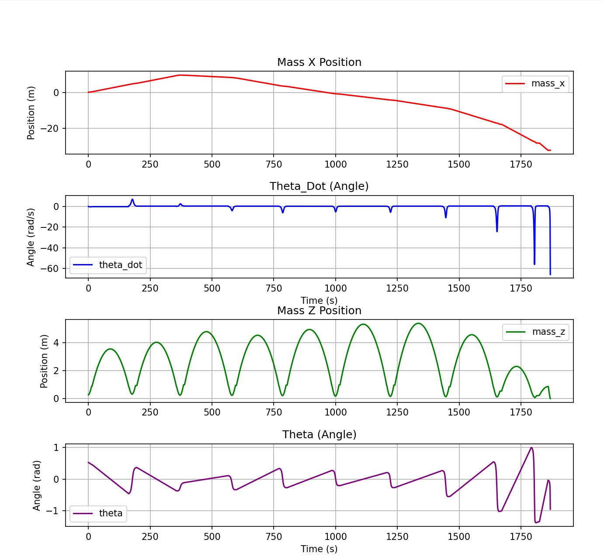
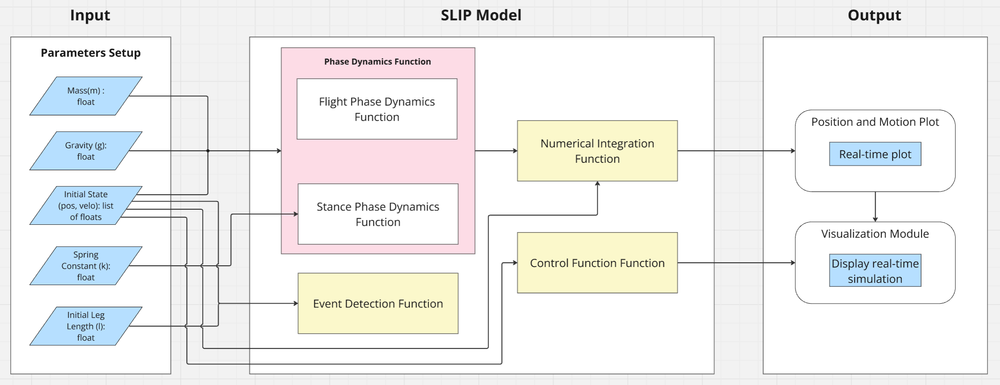
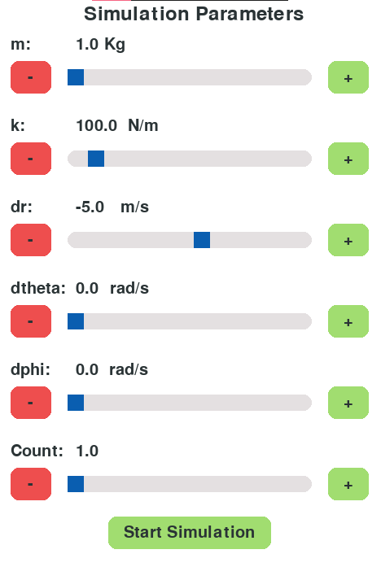
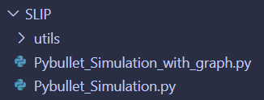
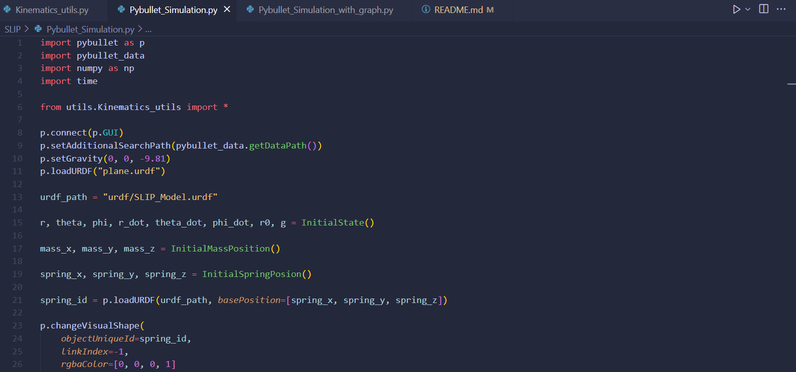
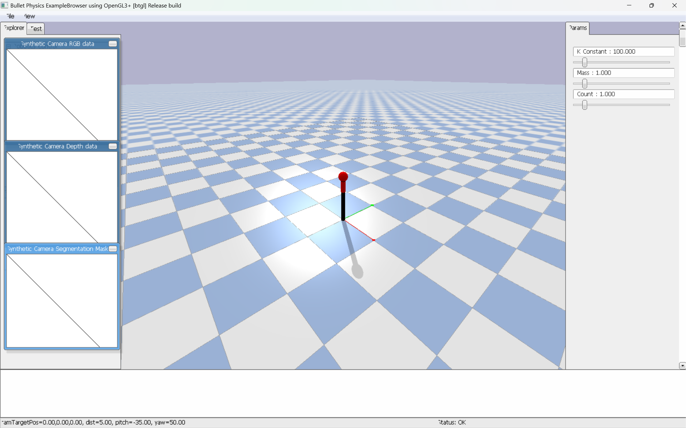
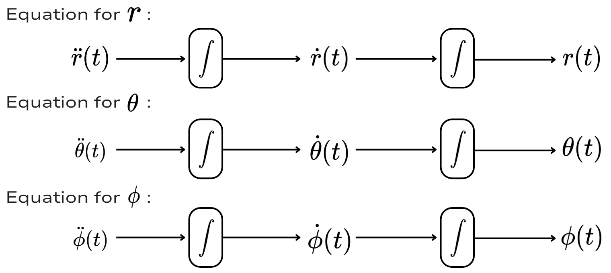
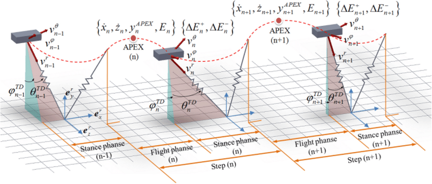
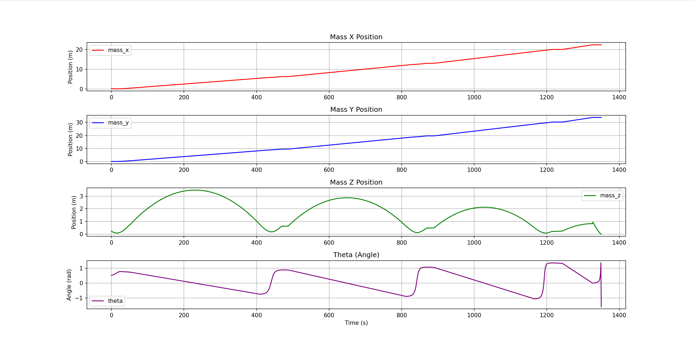
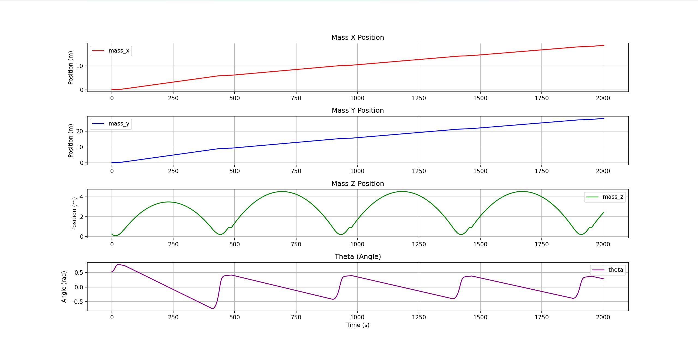

# SLIP Model Simulation in 3D Motion

This project provides a simulation of the `SLIP (Spring Loaded Inverted Pendulum)` model in 3D motion using PyBullet. The model allows you to adjust various parameters for the simulation. It includes kinematic equations that can be utilized for other simulations, and the project comes with a pre-configured URDF file that you can modify.

## Project Proposal
[G2 Kinematic Proposal](Document/G2_Kinematic_Proposal.pdf)

## Project Preview




## System Diagram



## Table of Contents

- [SLIP Model Simulation in 3D Motion](#slip-model-simulation-in-3d-motion)
  - [Project Proposal](#project-proposal)
  - [Project Preview](#project-preview)
  - [System Diagram](#system-diagram)
  - [Table of Contents](#table-of-contents)
  - [Introduction](#introduction)
  - [Features](#features)
  - [Requirements](#requirements)
  - [Installation](#installation)
  - [Usage](#usage)
    - [Adjustable Parameters](#adjustable-parameters)
      - [`Mass`:](#mass)
      - [`Spring Stiffness`:](#spring-stiffness)
      - [`Spring Velocity`:](#spring-velocity)
      - [`Initial Orientation Velocity`:](#initial-orientation-velocity)
      - [`SLIP Jump Count`](#slip-jump-count)
    - [URDF File Modification](#urdf-file-modification)
    - [Run a Program](#run-a-program)
  - [Kinematic Equations](#kinematic-equations)
    - [**`Stance Phase` | Equation of Motion**:](#stance-phase--equation-of-motion)
    - [SLIP Phases](#slip-phases)
    - [**`Stance Phase` | Position of Mass**:](#stance-phase--position-of-mass)
    - [**`Flight Phase` | Position of Mass**:](#flight-phase--position-of-mass)
    - [**`Flight Phase` | Position of Spring Base**:](#flight-phase--position-of-spring-base)
  - [Functions](#functions)
    - [`InitialState()`](#initialstate)
    - [`StancePhase()`](#stancephase)
    - [`StancePhaseControl()`](#stancephasecontrol)
    - [`StanceToFlight()`](#stancetoflight)
    - [`FlightPhase()`](#flightphase)
  - [Result](#result)
    - [Simulation Parameters](#simulation-parameters)
    - [**Without PD Control**](#without-pd-control)
    - [**With PD Control**](#with-pd-control)
  - [Summary and Analysis](#summary-and-analysis)
    - [Summary](#summary)
    - [Analysis](#analysis)
  - [References](#references)
  - [Contributors](#contributors)

## Introduction

The SLIP model is a simplified model used to describe the kinematics of a running or hopping robot. In this project, we simulate the SLIP model in 3D motion, where you can adjust physical parameters such as spring stiffness, spring length and mass. This simulation provides insights into the behavior of a spring-loaded inverted pendulum in simulation environments, and can be useful for researchers and engineers working in robotics.

## Features

- 3D simulation of the SLIP model using PyBullet
- Configurable physical parameters for the simulation (spring stiffness, spring length, etc.)
- Kinematic equations available for other simulations
- Pre-configured URDF file, which can be modified

## Requirements

- Python 3.x
- Matplotlib
- PyBullet
- NumPy

## Installation

1. Clone this repository:
   ```bash
   git clone https://github.com/FRA333-Kinematics-of-Robotics-System/SLIP-Model-Simulation.git
   ```
2. Moving path to project directory:
   ```bash
   cd SLIP-Model-Simulation
   ```
3. Install the required Python packages:
   ```bash
   pip install -r requirements.txt
   ```
4. Open Visual Studio Code for run a python:
   ```bash
   code .
   ```

## Usage

### Adjustable Parameters

You can modify the following parameters to customize the simulation:



#### `Mass`:
- Mass of the robot (kg)
#### `Spring Stiffness`: 
- Stiffness of the spring (N/m)
#### `Spring Velocity`: 
- Velocity of spring compressed (m/s)
#### `Initial Orientation Velocity`:
- Angular velocity in $\theta$ and $\phi$ (rad/s)
#### `SLIP Jump Count`
- Jump number count for SLIP simulation.


### URDF File Modification

The project includes a pre-configured URDF file for the robot. You can modify the URDF file to change the robot's design or parameters. The URDF file can be found in the `urdf/` directory. If you modified a URDF file you will need to change a STL file in `meshes/` too, for this project we use URDF file and STL from that export from `SolidWorks`.

### Run a Program

This project have an example simulation in `SLIP/` directory, you can run a program using Visual Studio Code for avoid any problem cause develop use Visual Studio Code too.



In SLIP directory contains 2 python file that you can use.

- `Pybullet_Simulation_with_graph.py`

  This file run a SLIP simulation with a Matplotlib graph for visual and debugging.

- `Pybullet_Simulation.py`

  This file run only a SLIP simulation using Pybullet.



You can easily run those filw using run button on the top right of a Visual Studio Code windows.



After run a program Pybullet simulation will pop-up you can adjust parameter before lauch a SLIP, then press `ENTER` for start a simulation
## Kinematic Equations

The following kinematic equations are utilized in the project.

### **`Stance Phase` | Equation of Motion**: 

**Equation for $\ddot{r}$:**

$$\ddot{r}(t) = \frac{mr(t)(\dot{\theta}(t)^2 + \sin^2(\theta(t))\dot{\phi}(t)^2) + k(r_0 - r(t)) - mg\cos(\theta(t))}{m}$$

To find $r(t)$, we can integrate this equation twice:

$$r(t) = \iint \ddot{r}(t) , dt$$

**Euler-Lagrange Equation for $\theta$:**

$$\ddot{\theta}(t) = \frac{g\sin(\theta(t)) - 2\dot{r}(t)\dot{\theta}(t) + \frac{1}{2}\sin(2\theta(t))\dot{r}(t)\dot{\phi}(t)^2}{r(t)}$$

To find $\theta(t)$, we can integrate this equation once:

$$\theta(t) = \iint \ddot{\theta}(t) , dt$$

**Euler-Lagrange Equation for $\phi$:**

$$\ddot{\phi}(t) = \frac{-\dot{r}(t)\sin(2\theta(t))\dot{\phi}(t)\dot{\theta}(t) - 2\dot{r}(t)\sin(\theta(t))\dot{\phi}(t)}{r(t)\sin(\theta)}$$

To find $\phi(t)$, we can integrate this equation once:

$$\phi(t) = \iint \ddot{\phi}(t) , dt$$

**For $r(t), \theta(t)$ and $\phi(t)$**



**where**:

- $r(t)$ is the length of the spring compressed.

- $\theta(t)$ is the orientation of robot in z axis .

- $\phi(t)$ is the orientation of robot between xy axis.

- $m$ is the mass of the robot.

- $g$ is the acceleration due to gravity.

- $k$ is the spring constant.

- $r_0$ is the length of the spring.

### SLIP Phases



### **`Stance Phase` | Position of Mass**: 

$$x(t) = x_c + \sin(\theta(t))\cos(\phi(t))$$

$$y(t) = y_c + \sin(\theta(t))\sin(\phi(t))$$

$$z(t) = z_c + r(t) + \cos(\theta(t))$$

**where**:

- $x_c, y_c, z_c$ are the mass position.

### **`Flight Phase` | Position of Mass**:

$$x(t) = x_i + \dot{x}_it$$

$$y(t) = y_i + \dot{y}_it$$

$$z(t) = z_i + \dot{z}_it - \frac{1}{2}gt^2$$

**where**:
- $x_i, y_i, z_i$ are the initial position before projectile.

- $\dot{x}_i, \dot{y}_i, \dot{z}_i$ are the initial velocity components before projectile.

- $g$ is the acceleration due to gravity.

### **`Flight Phase` | Position of Spring Base**:

$$x_c = x(t) - r(t)\sin(\theta(t))\cos(\phi(t))$$

$$y_c = y(t) - r(t)\sin(\theta(t))\sin(\phi(t))$$

$$z_c = z(t) - r(t)\cos(\theta(t))$$

**Where**:

- $x(t)$: The x-coordinate of the center of mass position.

- $y(t)$: The y-coordinate of the center of mass position.

- $z(t)$: The z-coordinate of the center of mass position.

## Functions

### `InitialState()`

```py
def InitialState(_r0=1.0, _r=0.3, _theta=np.pi/6, _phi=np.pi/6, _r_dot=0.0, _theta_dot=0.0, _phi_dot=0.0, _g=-9.81)
```

The `InitialState` function initializes and returns the initial state parameters for system.

**Needed Parameters**:
- `_r0` (default: 1.0): Length of the spring (m)

- `_r` (default: 0.3): Length of the spring compressed (m)

- `_theta` (default: π/6): Starting orientation of the robot in z axis (in radians)

- `_phi` (default: π/6): Starting orientation of the robot between xy axis (in radians)

- `_g` (default: -9.81): Gravitational acceleration ($m/s^2$)

### `StancePhase()`

```py
def StancePhase(m, k, r0, g, time_step, r, r_dot, theta, theta_dot, phi, phi_dot ,spring_x, spring_y, spring_z)
```

The `StancePhase` function simulates the kinematics of a Spring-Loaded Inverted Pendulum (SLIP) from equation giving before, during its stance phase, calculating the motion and position of a mass.

**Needed Parameters**:

- `m`: Mass of the robot (kg)

- `k`: Spring constant (N/m)

- `r0`: Length of the spring (m)

- `g`: Gravitational acceleration ($m/s^2$)

- `time_step`: Simulation time increment (s)

- `r`: Length of the spring compressed (m)

- `theta`: Orientation of the robot in z axis (in radians)

- `phi`: Orientation of the robot between xy axis (in radians)

- `spring_x`, `spring_y`, `spring_z`: Position of spring attachment coordinates

**Return**:
- Absolute mass point coordinates (`mass_x`, `mass_y`, `mass_z`)

### `StancePhaseControl()`

```py
def StancePhaseControl(m, k, r0, g, time_step, r, r_dot, theta, theta_target, theta_dot, phi, phi_dot ,spring_x, spring_y, spring_z, Kp, Kd):
```

The `StancePhaseControl` function simulates the kinematics of a Spring-Loaded Inverted Pendulum (SLIP) from equation giving before, during its stance phase, calculating the motion and position of a mass with a `Kp` and `Kd` control.

**Needed Parameters**:

- `m`: Mass of the robot (kg)

- `k`: Spring constant (N/m)

- `r0`: Length of the spring (m)

- `g`: Gravitational acceleration ($m/s^2$)

- `time_step`: Simulation time increment (s)

- `r`: Length of the spring compressed (m)

- `theta`: Orientation of the robot in z axis (in radians)

- `phi`: Orientation of the robot between xy axis (in radians)

- `spring_x`, `spring_y`, `spring_z`: Position of spring attachment coordinates

- `Kp`: Proportional gain for theta control

- `Kd`: Derivative gain for theta control

**Return**:
- Absolute mass point coordinates from a PD control (`mass_x`, `mass_y`, `mass_z`)

### `StanceToFlight()`

```py
def StanceToFlight(mass_x, mass_y, mass_z, theta, phi, r_dot, r, theta_dot, phi_dot):
```

The `StanceToFlight` function manages the transition from stance to flight phase in a SLIP (Spring-Loaded Inverted Pendulum) robot model, calculating initial conditions for the flight phase.

**Needed Parameters**:
- `mass_x`: X-coordinate of the mass (m)

- `mass_y`: Y-coordinate of the mass (m)

- `mass_z`: Z-coordinate of the mass (m)

- `theta`: Orientation of the robot in z axis (in radians)

- `phi`: Orientation of the robot between xy axis (in radians)

- `r`: Length of the spring compressed (m)

**Returns**:
- Absolute spring point coordinates (`spring_x`, `spring_y`, `spring_z`)

### `FlightPhase()`

```py
def FlightPhase(x_i, y_i, z_i, r, theta, phi, theta_i, t, g, dx, dy, dz, T):
```

The `FlightPhase` function simulates the kinematics of a Spring-Loaded Inverted Pendulum (SLIP) from equation giving before, during its flight phase, calculating the motion and position of a mass in projectile motion.

**Needed Parameters**:
- `x_i`: X-coordinate position before projectile.

- `y_i`: Y-coordinate position before projectile.

- `z_i`: Z-coordinate position before projectile.

- `r`: Length of the spring compressed (m)

- `theta`: Orientation of the robot in z axis (in radians)

- `phi`: Orientation of the robot between xy axis (in radians)

**Returns**:

- Absolute spring point coordinates (`spring_x`, `spring_y`, `spring_z`)

- Absolute mass point coordinates (`mass_x`, `mass_y`, `mass_z`)

- New `theta` for flight phase.

## Result

### Simulation Parameters
The simulation was conducted using the following parameters:

| Parameter               | Value         | Unit        |
|-------------------------|---------------|-------------|
| Mass (`m`)              | 1.0           | kg          |
| Spring Stiffness (`k`)  | 100           | N/m         |
| Spring Compression Rate (`dr`) | -6          | m/s         |
| Angular Velocity in $\theta$ (`dtheta`) | 1.0         | rad/s       |
| Angular Velocity in $\phi$ (`dphi`) | 1.0         | rad/s       |
| SLIP Jump Count (`count`)  | 4           | count       |


### **Without PD Control**
In this configuration, the simulation does not use proportional-derivative (PD) control for stabilization. Below is the result:

**Video (without PD Control)**

[VideoWithoutPDControl](.images/VideoWithoutPDControl.mp4)

**Graphs (without PD Control)**
To further illustrate the behavior, below are graphs of key parameters over time (e.g., x, y, z, theta):



- **Observations:**
  - Over time, the system fails to maintain balance, causing the robot to lose its ability to perform multiple consecutive jumps.

### **With PD Control**
With the addition of PD control, the simulation achieves เพื่อให้โมเดลสามารถกระโดดไปได้เรื่อยๆ. Below is the result:

when  `kp`: 37 and
      `kd`: 20

**Video (with PD Control)**

[VideoWithPDControl](.images/VideoWithPDControl.mp4)

**Graphs (with PD Control)**
To further illustrate the behavior, below are graphs of key parameters over time (e.g., x, y, z, theta):



- **Observations:**
  - The system is effectively stabilized using PD control gains (Kp and Kd), allowing the robot to maintain consistent jumping behavior across multiple cycles.
  - From the graphs, it is evident that the theta value changes more smoothly compared to the simulation without PD control.
  - The smoother control of theta prevents abrupt oscillations, enabling the robot to sustain consecutive jumps.
  - However, as the number of jumps increases, small errors in theta accumulate, leading to a gradual drift in the model. This occurs because the simulation does not use a closed-loop control system to correct accumulated errors.

## Summary and Analysis

### Summary
This simulation effectively demonstrates the motion of a 3D Spring-Loaded Inverted Pendulum (SLIP) model under two control configurations: with and without PD control. Without PD control, the system struggles to maintain balance, resulting in erratic and unstable behavior during jumps. In contrast, the introduction of PD control significantly enhances stability, allowing the system to perform smooth and continuous jumps. However, over time, small errors in theta accumulate due to the lack of a closed-loop control mechanism, which limits long-term performance.

### Analysis
The results highlight the importance of control strategies in robotic systems. PD control ensures that theta changes as expected, allowing the model to move smoothly and continuously. This makes it effective for achieving stability in the short term. However, for longer-term performance, error accumulation in theta becomes noticeable, eventually affecting the model's ability to maintain consistent motion. A closed-loop control system or advanced strategies would be necessary to address this issue.

Additionally, the simulation currently lacks real-world factors such as friction, ground irregularities, and sensor noise, which could significantly impact the behavior of the system in practical applications.

Future work could focus on refining the control parameters, incorporating environmental variability, and applying the findings to real-world scenarios, such as legged or hopping robots. These steps would help to better understand the dynamics and limitations of the SLIP model.

## References
- [Spring-loaded Inverted Pendulum (SLIP) Control | Danfoa Github](https://github.com/Danfoa/slip_control)

## Contributors

<p>
  
  <b>Apichaya Sriwong</b> - <a href="https://github.com/ImJAiiiii">ImJAiiiii</a> - Developer Researcher
</p>

<p>
  
  <b>Poppeth Petchamli</b> - <a href="https://github.com/Toonzaza">Toonzaza</a> - Developer
</p>

<p>
  
  <b>Vasayos Tosiri</b> - <a href="https://github.com/TeeTyJunGz">TeeTyJunGz</a> - Developer
</p>
