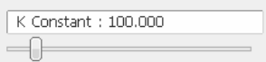

# SLIP Model Simulation in 3D Motion

This project provides a simulation of the SLIP (Spring Loaded Inverted Pendulum) model in 3D motion using PyBullet. The model allows you to adjust various parameters for the simulation. It includes kinematic equations that can be utilized for other simulations, and the project comes with a pre-configured URDF file that you can modify.

## Table of Contents

- [Introduction](#introduction)
- [Features](#features)
- [Requirements](#requirements)
- [Installation](#installation)
- [Usage](#usage)
  - [Adjustable Parameters](#adjustable-parameters)
  - [URDF File Modification](#urdf-file-modification)
- [Kinematic Equations](#kinematic-equations)
- [Functions](#functions)
- [Contributions](#contributions)
- [License](#license)

## Introduction

The SLIP model is a simplified model used to describe the kinematics of a running or hopping robot. In this project, we simulate the SLIP model in 3D motion, where you can adjust physical parameters such as spring stiffness, spring length and mass. This simulation provides insights into the behavior of a spring-loaded inverted pendulum in simulation environments, and can be useful for researchers and engineers working in robotics.

## Features

- 3D simulation of the SLIP model using PyBullet
- Configurable physical parameters for the simulation (spring stiffness, spring length, etc.)
- Kinematic equations available for other simulations
- Pre-configured URDF file, which can be modified

## Requirements

- Python 3.x
- PyBullet
- NumPy

## Installation

1. Clone this repository:
   ```bash
   git clone https://github.com/FRA333-Kinematics-of-Robotics-System/SLIP-Model-Simulation.git
   ```
2. Install the required Python packages:
   ```bash
   pip install pybullet numpy
   ```

## Usage

### Adjustable Parameters

You can modify the following parameters to customize the simulation:

#### `Spring Stiffness`:

- Stiffness of the spring (N/m)
- Adjust via Pybullet param on top right of simulation.
- Or Adjust in `Pybullet_Simulation.py` file at `line 44`.

#### `Mass`:

- Mass of the robot (kg)
- Adjust via Pybullet param on top right of simulation.
- Or Adjust in `Pybullet_Simulation.py` file at `line 41`.

#### `Spring Length`: 

```py
def InitialState(_r0=1.0, _r=0.3, _theta=np.pi/6, _phi=0.0, _r_dot=0.0, _theta_dot=0.0, _phi_dot=0.0, _g=-9.81):
```

- `_r0` : Length of the spring (m)
- `_r` : Length of the spring compressed (m)
- Adjust via `Pybullet_Simulation.py` file at `line 14`.

**Example**

```py
r, theta, phi, r_dot, theta_dot, phi_dot, r0, g = InitialState(_r0=1.5, _r=0.7)
```

#### `Initial_Orientation`:

```py
def InitialState(_r0=1.0, _r=0.3, _theta=np.pi/6, _phi=0.0, _r_dot=0.0, _theta_dot=0.0, _phi_dot=0.0, _g=-9.81):
```

- `_theta` : Starting orientation of the robot in x axis (radian)
- `_phi` : Starting orientation of the robot in y axis (radian)

**Example**

```py
r, theta, phi, r_dot, theta_dot, phi_dot, r0, g = InitialState(_theta=np.pi/7, _phi=np.pi/6)
```

<!-- ### URDF File Modification

The project includes a pre-configured URDF file for the robot. You can modify the URDF file to change the robot's design or parameters. The URDF file can be found in the `urdf/` directory.

## Kinematic Equations

The following kinematic equations are utilized in the project:

1. **Spring Force**: 
   """
   F_spring = k * (x - l_0)
   """
   - Where `k` is the spring constant, `x` is the displacement, and `l_0` is the natural length of the spring.

2. **Leg Kinematics**:
   """
   x_leg = l * cos(θ)
   y_leg = l * sin(θ)
   """
   - Where `l` is the length of the leg, and `θ` is the angle of the leg relative to the ground.

## Functions

### `simulate_slip()`

Simulates the SLIP model dynamics in 3D using the given parameters.

### `calculate_kinematics()`

Calculates the kinematics of the robot based on the current state and parameters.

## Contributions

Feel free to fork the repository, make changes, and submit pull requests.

## License

This project is licensed under the MIT License - see the [LICENSE](LICENSE) file for details. -->